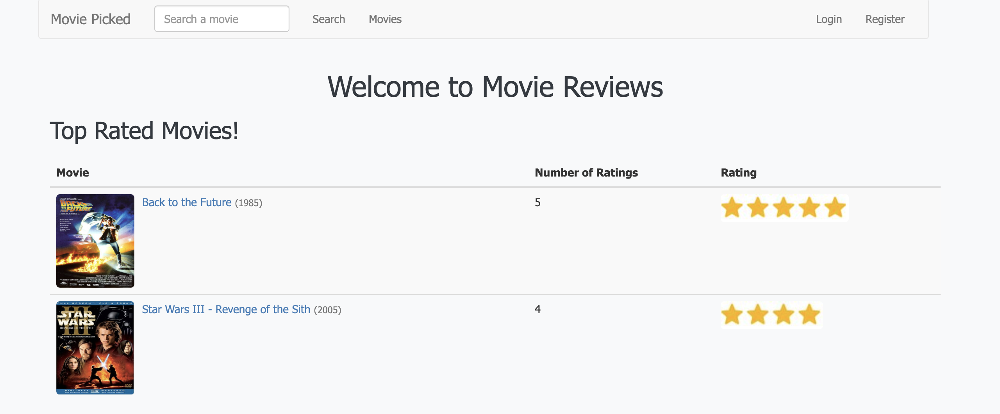

# Movie Reviews

**Movie Reviews** is a web application that lets users browse and vote for their favorite movies. The project was *
*inspired by [IMDb](https://www.imdb.com/)**, aiming to create a simple and interactive platform for movie enthusiasts.
Originally built with JSP, Spring, and Tiles, this project is being migrated to **modern technologies**, including *
*Spring 6**, **Thymeleaf**, **Bootstrap 3+**, and **RESTful endpoints**.

## Features

- Browse movies and view the most voted.
- Search movies with an autocomplete feature.
- Movie detail pages with ratings and votes.
- User authentication with roles (admin and regular users).
- Responsive design using Bootstrap.

## Tech Stack

- Java 17+
- Spring Framework 6
- Hibernate – ORM for mapping Java entities to database tables
- H2 Database – In-memory database for development/testing
- Thymeleaf for templates
- jQuery for client-side interactivity
- Bootstrap 3 for styling
- Maven for dependency management

## Modernization Goals

- Replace JSP and Tiles with Thymeleaf templates.
- Convert old `.html` endpoints to RESTful API endpoints.
- Improve frontend JS with clean, maintainable code.
- Prepare the project for potential SPA integration in the future.

## Running the Project

### 1. **Clone the repository**

```bash
git clone https://github.com/alanquintero/movie-reviews.git
cd movie-reviews
```

### 2. Build with Maven

```bash
mvn clean install
```

### 3. Run the application

- Import the project into your IDE as a Maven project.
- Make sure you have a servlet container like Tomcat configured.
- Build and deploy the project to the server.
  Example using Jetty:

```bash
mvn jetty:run
```

### 4. Access the app

Open a browser and go to http://localhost:8080



## Notes

- The project is in active modernization, so some features may not yet work.
- All legacy JSP/Tiles code is being replaced step by step with Thymeleaf templates and modern Spring conventions.
- For developers: follow the header.html and layout.html migration plan to continue modernization.
