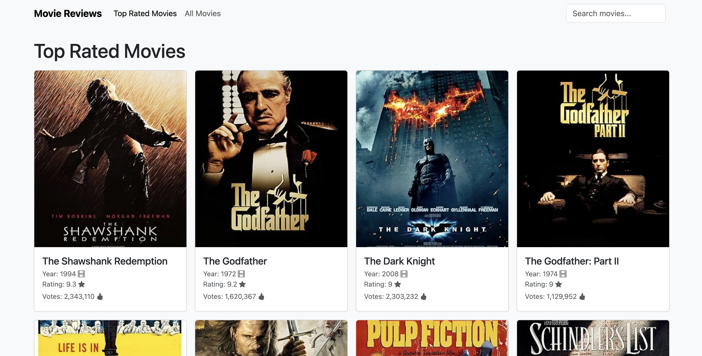
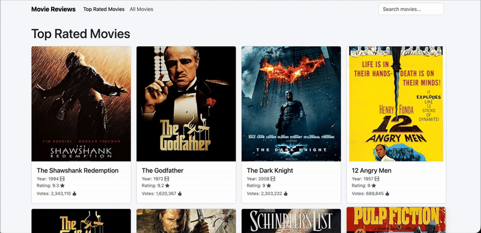
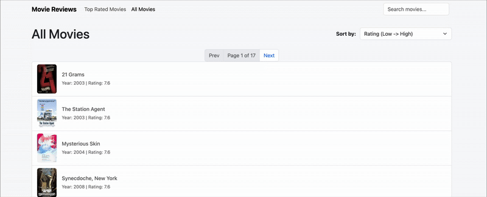

# 🎬 Movie Reviews

An IMDb-inspired movie browsing and search web app.
This project allows users to quickly search movies by title prefix and browse all available titles with pagination.
It’s built with **Spring Boot**, and **JavaScript**, featuring a **Trie** data structure for fast search operations.



---

## 🚀 Features

### 🔎 Smart Movie Search

* Type a few letters in the search box to instantly find matching movie titles.
* Uses a **Trie** (prefix tree) for efficient search performance — ideal for large datasets.




### 📚 Movie List

* View all movies with pagination.
* Pagination controls available **both at the top and bottom** of the list.
* Clean, responsive, and simple UI.



### 👉 Click on any movie to see the full movie information


### 💾 Dataset

The movie data is based on IMDb’s Top 1000 movies, sourced from
👉 [JaviRute/top_1000_movies-data_science_project](https://github.com/JaviRute/top_1000_movies-data_science_project)

Many thanks to the author for compiling this dataset.

---

## 🧠 Motivation

This project was inspired by [IMDb](https://www.imdb.com/), with the goal of learning how to:

* Build a **search feature using data structures** (Trie).
* Design **RESTful APIs** with **Spring Boot**.
* Connect a **Java backend** with a **JavaScript frontend**.
* Implement **pagination** and handle real-world API responses in the UI.

It’s both a fun learning project and a useful template for any searchable dataset.

---

## 🧩 Tech Stack

| Layer          | Technology                             |
|----------------|----------------------------------------|
| Backend        | Spring Boot 3, Spring Web, Spring Data |
| Frontend       | HTML, CSS, Vanilla JavaScript          |
| Data Structure | Trie (for prefix search)               |
| API Format     | REST / JSON                            |
| Build Tool     | Maven                                  |
| Java Version   | 17+                                    |

---

## 🧪 How to Run

### 1️⃣ Clone the repository

```bash
git clone https://github.com/alanquintero/movie-reviews
cd movie-reviews
```

### 2️⃣ Build the project

```bash
mvn clean install
```

### 3️⃣ Run the app

```bash
mvn spring-boot:run
```

### Run tests
```bash
mvn test
```

### Run tests with coverage (jacoco)
```bash
mvn clean verify
```

### 4️⃣ Open in browser

Visit 👉 [http://localhost:8080](http://localhost:8080)


---

## 📨 Kafka (Optional)

Run Kafka locally with Docker:

```bash
docker compose up -d
```

Spring Boot connects to Kafka using:

```properties
spring.kafka.bootstrap-servers=localhost:29092
```

**Notes**

* App runs at `http://localhost:8080`
* Kafka runs at `localhost:29092`
* If running the app inside Docker, use:

  ```properties
  spring.kafka.bootstrap-servers=kafka:9092
  ```

---
